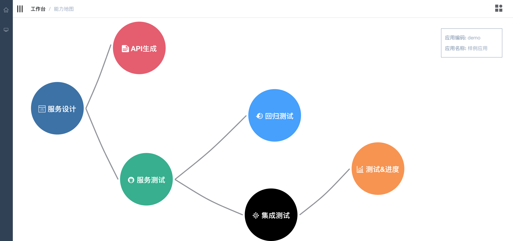
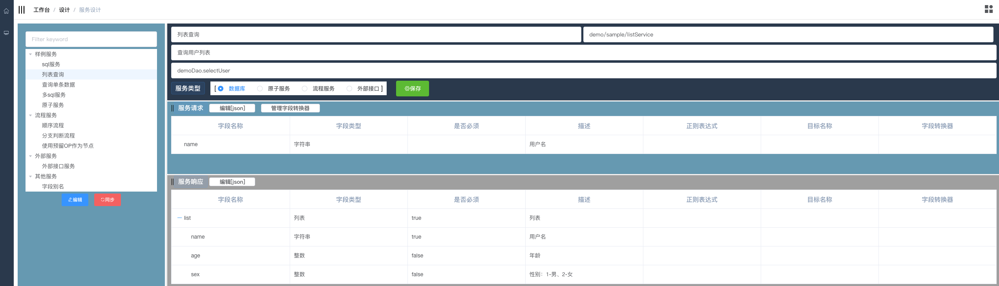
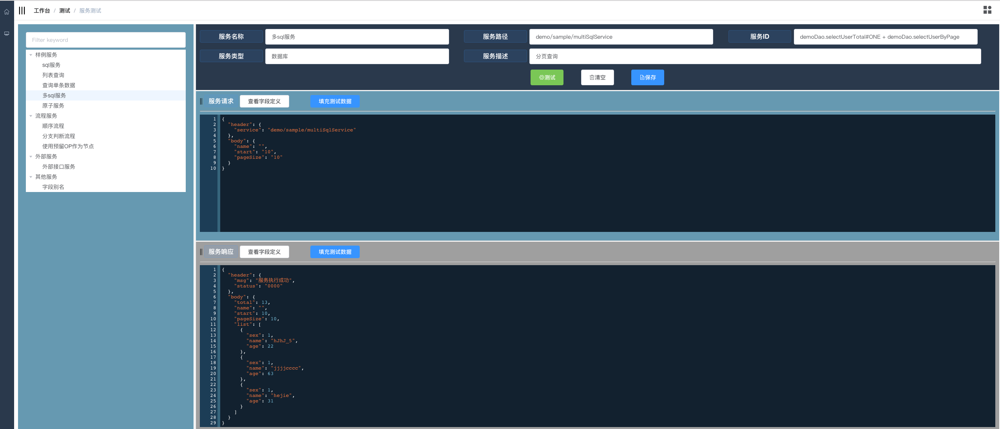
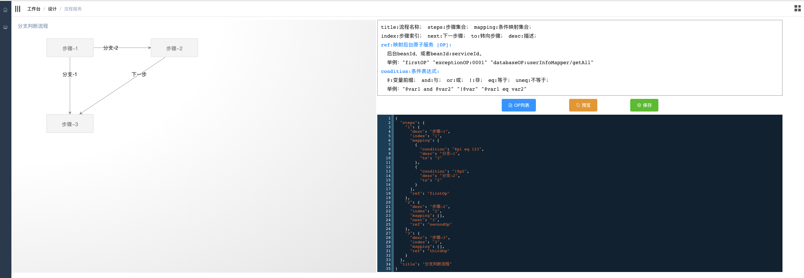

```tex
                                         / / /
    ___               __      ___         / /
  //   ) ) //   / / //  ) ) //___) )     / /
 //___/ / //   / / //      //           / /
//       ((___( ( //      ((____  ((___/ /
::====== pureJ by HJ ======:: [纯简的java服务应用]
```

----


## [快速开始](doc/start/GetStarted.md) 


## [开发指南](doc/developers/DeveloperGuide.md)


## What?

拒绝重复的、机械化的代码——基础业务 ***零***  Java代码；

不生成代码，因为，能生成的代码必然是可以抛弃的代码；

从设计驱动开发，到设计即开发；

工具化，集设计、开发、测试、文档为一体，减少低效沟通、管理成本和进度追问。

## Why?

被MVC绑架的这些年，我们从JSP + servlet + javabean，到Struts + Spring + Hibernate，再到 spring(family) + mybatis，又到Spring(boot/cloud)  + 范中间件，如今到前端工程 + 后端工程 + DevOps(Docker/Kubernates)。

我们从最开始的HTML、JavaScript、css、servlet、javabean、sql一把抓，到如今精细分工。数据分析、挖掘相关的工作已经被类似大数据相关的业务部门拿走了；业务交互系统越来越被定义为小而精，用户交互的复杂度已经被UI/UE、前端开发分担了；开发、测试、部署、持续集成等相关的复杂度，也已经被DevOps建设者处理掉了。那对于服务端开发，似乎只需要封装restful接口就OK了，已经足够简单了！

但，这剩下的最简单的，***纯数据存取业务系统开发***，我们的公司、团队是否还在要求各种编码规范，还在强调优秀的设计模式，各种最佳实践。这些曾经指导我们“正确”编码的思想，现在面对这种极其简单，甚至有些机器化的开发工作，还需要吗？还有必要吗？杀鸡焉用牛刀？

----

功能：**<u>分页查询列表信息</u>**

你的java代码是否包含这些内容：查询表单模型（FormVO.java）、控制器（Controller.java）、接口定义（Service.java）、接口实现（ServiceImpl.java）、数据库访问接口（Mapper/Dao.java）、数据库访问操作（Mapper.xml）、数据库模型（Model.java）、表格数据显示模型（ViewDto.java）、分页对象（Page.java）。

这已经是9个文件，如果查询的业务是多表关联的，那我们还要关联更多的数据库模型javabean文件。似乎看起来很合理、很清晰，代码简单易懂，层次分明。

但，双击点开每个文件观察一下，你会发现，对于实现这个功能，我们真正需要的只是那条sql语句，而Controller中只有一行代码有用（对service的调用），Service实现中也只有一行代码有意义（对dao的调用）。其余的文件呢？要么是只有get/set的javabean，要么就是纯接口定义，这些文件是多么机械、多么没有技术含量。

其次，这些“简单易懂、层次分明”的代码，还会是你的绊脚石。客户或者boss说我想在页面上展示xxx信息，并作为查询条件，很简单吧，明早上我要看！  程序猿：玩蛋！数据库没设计这个字段，加！然后各种VO、DTO、Model全改一遍，打包、测试、部署上线。完美，凌晨两点，扔掉泡面盒，轻呼：小场面~~~

## Who?

如果你的日常工作内容就是上面的模式，那你需要看看pureJ。因为在这样的环境对你很不利。今天你能这样机械地（ctrl+c/v）工作，明天还可以吗？你应该摆脱这样的工作内容和模式，需要去思考和创造计算机做不到的事情，而不是像计算机那样思考。至少，pureJ会尽量让你更关注业务，关注设计。

技术应该用在真正需要技术的地方。你现在付出的，可能不是你的技术，而是你的体力。

## ScreenShot










