# 开发指南

## 目录结构

```tex
biz                 业务配置中心
 |--adapter         外部服务适配器配置
 |--channel         服务配置
 |   |--converter   字段转换器配置
 |   |--flow        服务流程配置
 |   |--service     服务配置
 |--conf            系统配置
 |   |--demo.yml    可热加载的系统配置
 |--data            开发配置工具产生的开发数据
 |   |--channel     服务数据
 |   |   |--input   服务输入数据
 |   |   |--output  服务输出数据
 |   |--menu        服务目录数据
 |       |--tree.json  服务目录树
 |--mapper          数据库操作的sql文件
     |--mysql       mysql的文件
     |--oracle      oracle的文件
core                核心框架
demo                demo应用
doc                 文档
launcher            开发配置工具
```

pureJ的目标是：**最大限度的减少机械式java代码的编写**。在理想情况下基础业务：**零** java代码。同时，biz中所有内容默认均为热加载，不需要频繁的启停服务。

## 快速搭建

见：[GetStarted](../start/GetStarted.md)

## 简易开发流程

**第一步**：修改服务目录树：tree.json。

也可在开发工具launcher中实时编辑（**推荐**）。

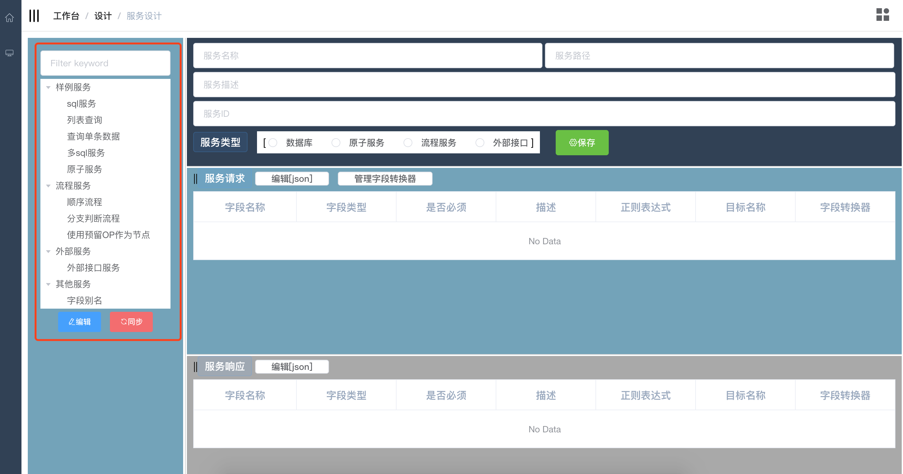

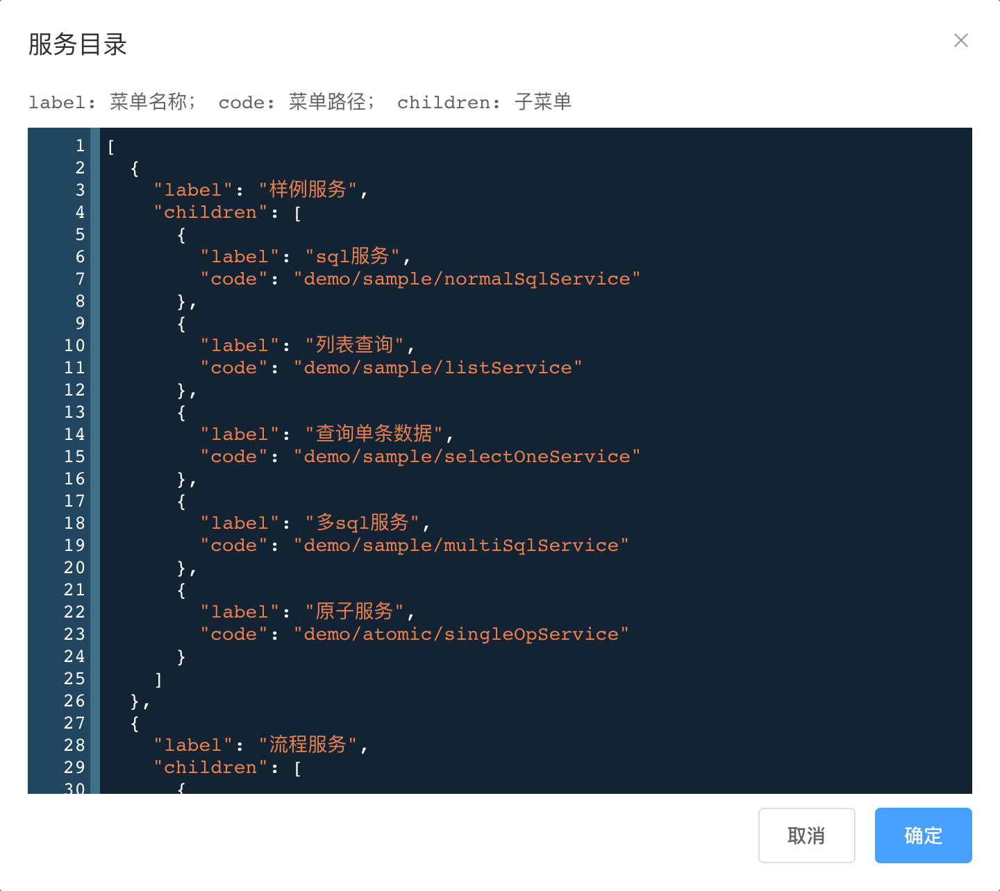

**第二步**：创建服务配置文件。

根据服务目录节点的code值，如：**demo/sample/normalSqlService**；在业务配置中心-->服务配置创建对应的xml文件，对应：biz/channel/service/**demo/sample/normalSqlService**.xml。

也可直接通过launcher页面直接保存创建（**推荐**）。

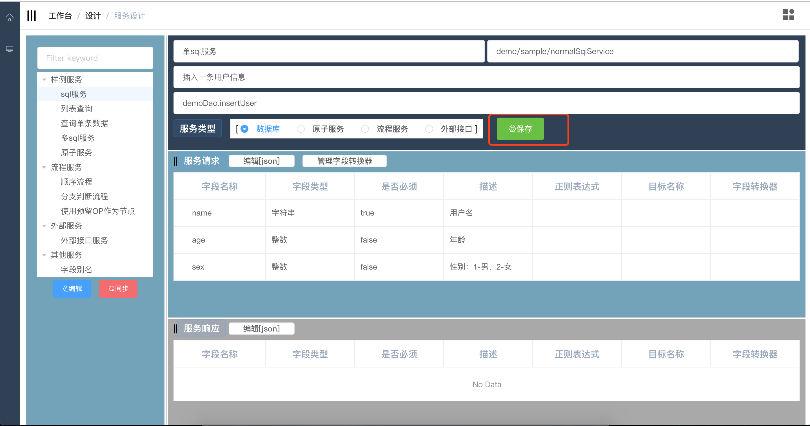

**第三步**：定义服务内容。

可以直接编辑xml文件，如：biz/channel/service/demo/sample/normalSqlService.xml，编辑的规范见：[服务配置定义](../config/服务配置定义.md)。

但更**推荐**在launcher中直接操作：

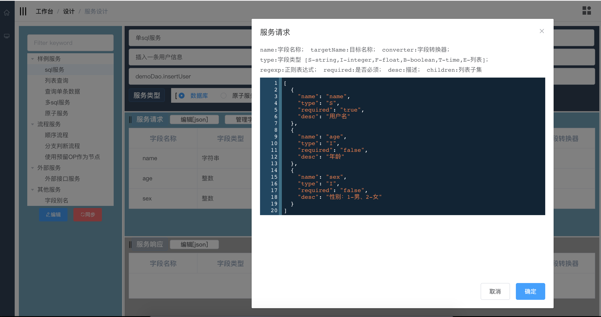

**第四步**：编写sql。

在服务配置文件中，有“服务ID”的配置项，如：demoDao.insertUser，即表示mapper目录下有一个xml文件namespace=demoDao，且包含一条sqlid=insertUser的语句：

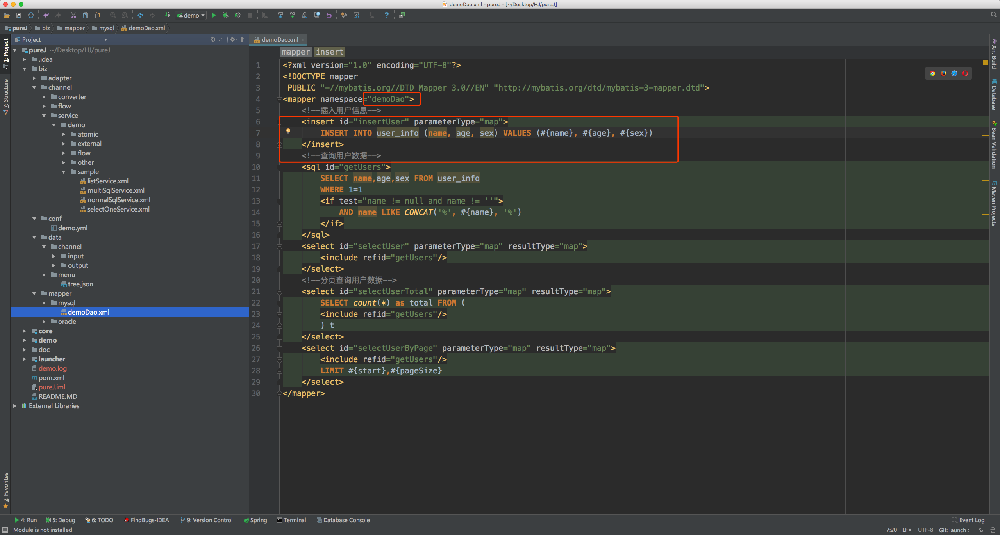

**第五步**：测试。

进入launcher服务测试页面，点击服务目录对应的节点，在服务请求框中编辑json数据（[json格式定义](../config/通讯报文定义.md)），点击测试。

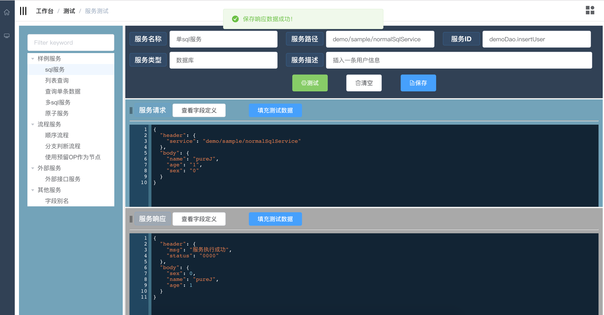


到此，一个服务开发完成，**不需要写任何java代码，同时也没有生成任何一行java代码**。

观察biz下各目录的变化。

## 定义流程服务

在launcher服务设计页面，服务类型为“流程服务”时，可对其流程图进行设计。

也可直接编辑如：biz/channel/flow/demo/sequenceFlow.xml（[流程定义规范](../config/流程配置定义.md)）

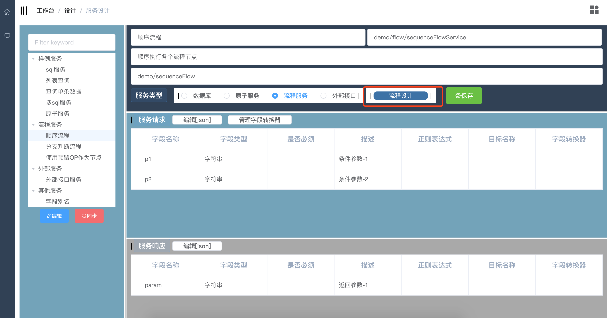

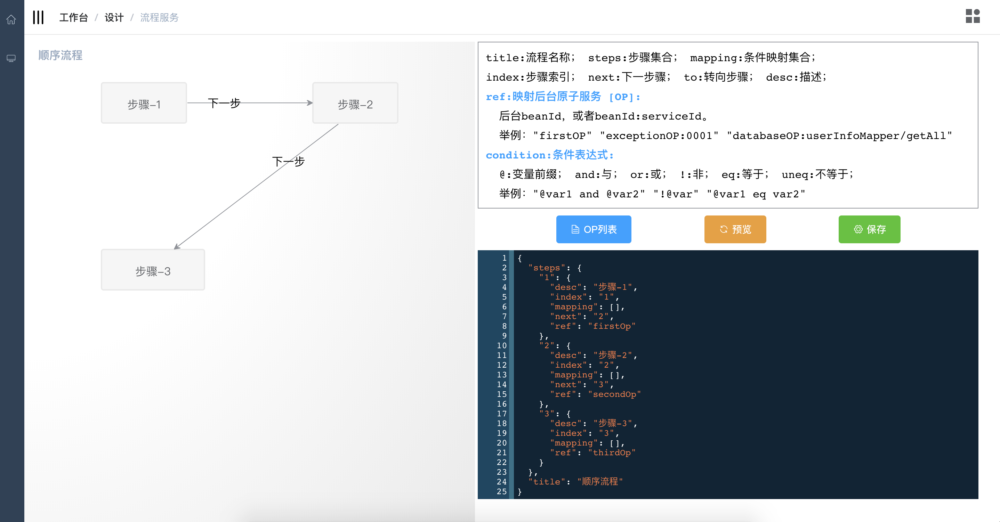

编辑json，点击预览可实时展示流程图；点击保存到flow目录下的xml文件。

OP列表：展示可选的ref值，为流程节点的具体处理单元。

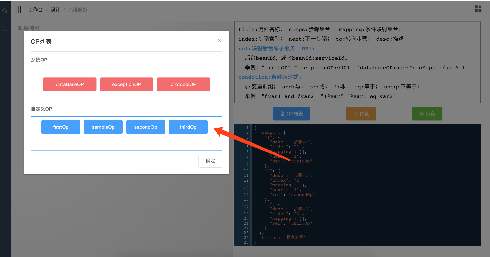

**注**：对于自定义的OP需要编写满足自身业务的java代码，但绝大部分情况下系统OP已经能满足业务需求，所以在决定编写自定义OP之前，请先斟酌斟酌。

自定义OP编写，请参考demo中相关代码。

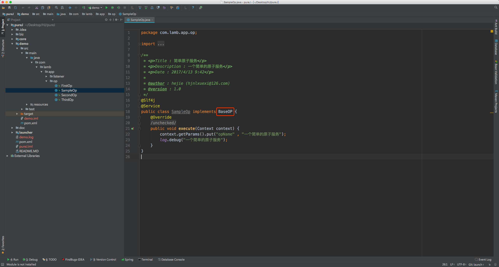

## 定义外部服务

在launcher服务设计页面，服务类型为“外部接口”时，可对其适配器进行设计。

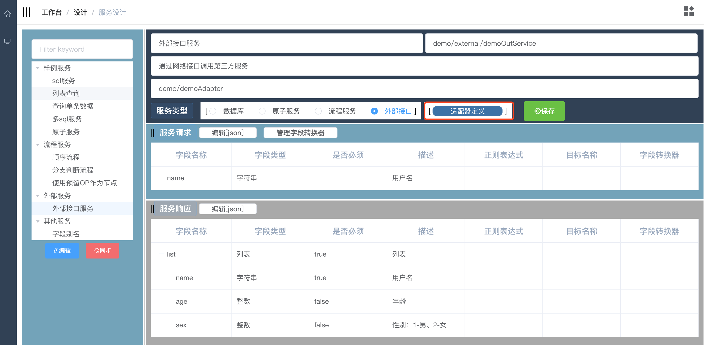

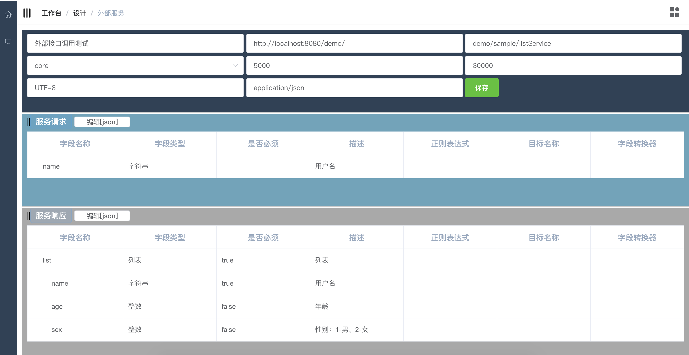

**注**：目前核心框架仅实现了，外部服务同为pureJ框架的服务，即适配器配置xml中的netTool：core。

如果你需要连接其他第三方的几口服务那么你需要编写代码，并为其取一个netTool名字，如：myNetTool。

netTool包含：报文组装器、报文解析器、服务连接器三个组件，每个组件实现响应的接口即可，具体可以参考内置netTool：core的编写方法。