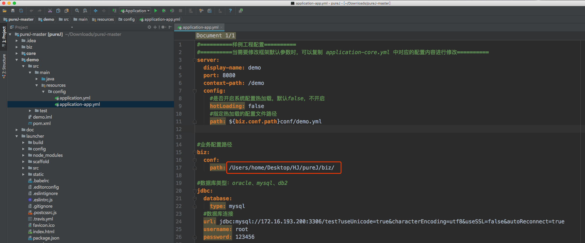
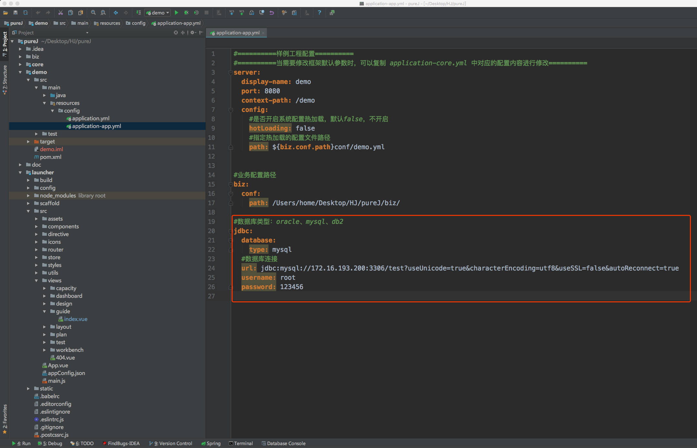
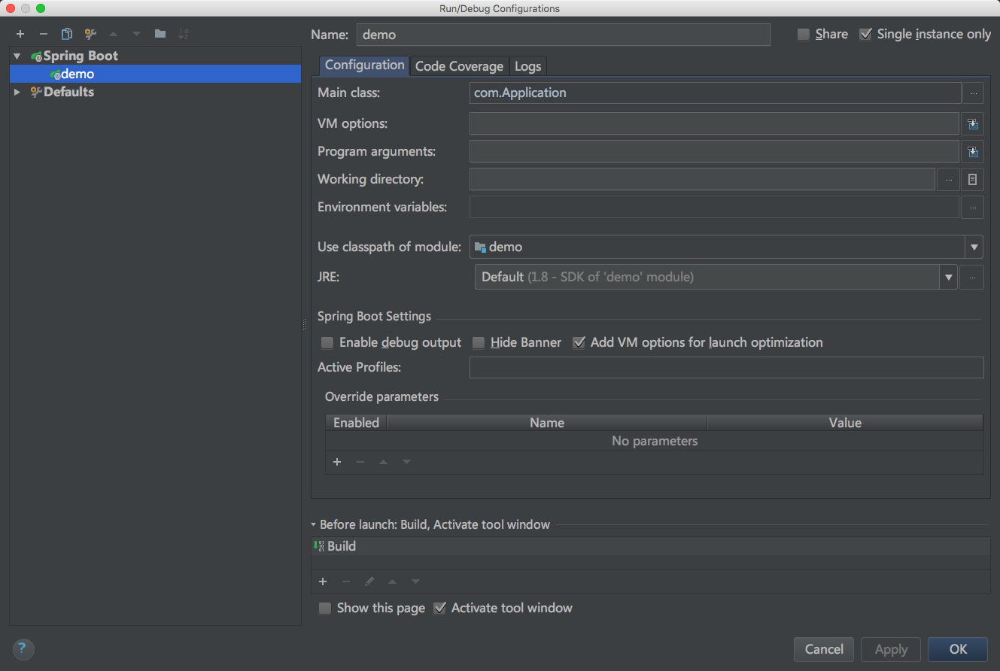
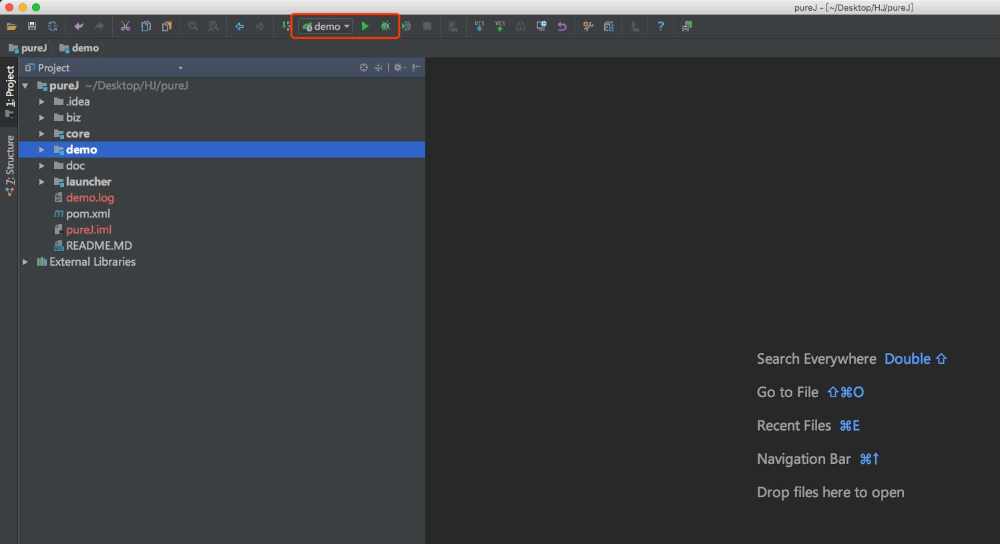

## 环境要求

nodeJS：6+

jdk：8+

maven：3+

## 安装配置工具

```shell
#克隆项目
git clone https://github.com/hjnlxuexi/pureJ.git

#进入launcher目录
cd launcher

#安装依赖
npm install

#启动launcher
npm run dev
```

浏览器访问：http://localhost:15910/#/


根据页面引导操作，再执行下面的步骤。

## 启动demo

修改业务配置路径



默认支持mysql数据库，其他数据库自行扩展。数据库连接：



demo数据库表：

```sql
create table user_info
(
 id int auto_increment comment '自增主键'
  primary key,
 name varchar(100) null comment '姓名',
 age int null comment '年龄',
 sex int default '1' null comment '性别：1-男、2-女',
 constraint user_id_uindex
  unique (id)
)
comment '用户'
;
```

配置后台应用启动类



启动demo应用

